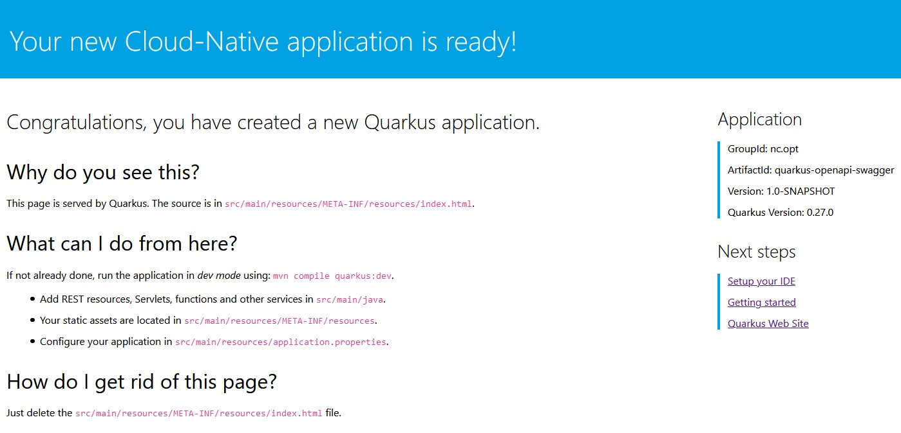
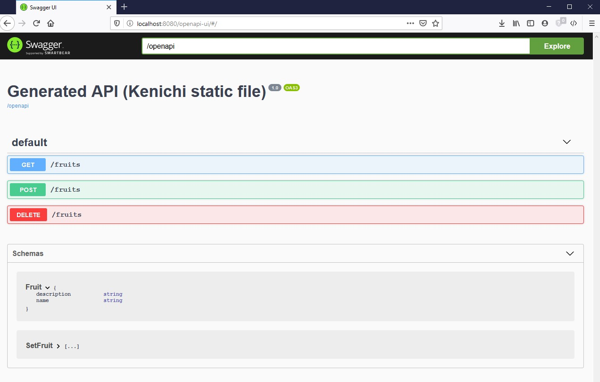
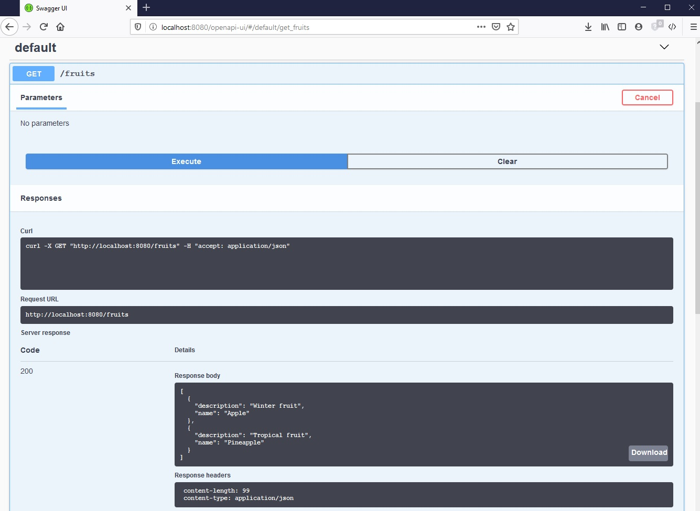

# Guide

Official guide here : https://quarkus.io/guides/openapi-swaggerui-guide

# Step by step

## Create Quarkus project

Initialize the project :

    mvn io.quarkus:quarkus-maven-plugin:0.27.0:create \
        -DprojectGroupId=nc.opt \
        -DprojectArtifactId=quarkus-openapi-swagger \
        -DclassName="nc.opt.openapi.FruitResource" \
        -Dpath="/fruits" \
        -Dextensions="resteasy-jsonb" \

Compile :

    mvn compile quarkus:dev

Test the application landing page : http://localhost:8080

## Create REST endpoints

Fruit :

    package nc.opt.openapi;

    public class Fruit {

        public String name;
        public String description;

        public Fruit() {
        }

        public Fruit(String name, String description) {
            this.name = name;
            this.description = description;
        }
    }

FruitResource :

    package nc.opt.openapi;

    import java.util.Collections;
    import java.util.LinkedHashMap;
    import java.util.Set;

    import javax.ws.rs.*;
    import javax.ws.rs.core.MediaType;

    @Path("/fruits")
    @Produces(MediaType.APPLICATION_JSON)
    @Consumes(MediaType.APPLICATION_JSON)
    public class FruitResource {

        private Set<Fruit> fruits = Collections.newSetFromMap(Collections.synchronizedMap(new LinkedHashMap<>()));

        public FruitResource() {
            fruits.add(new Fruit("Apple", "Winter fruit"));
            fruits.add(new Fruit("Pineapple", "Tropical fruit"));
        }

        @GET
        public Set<Fruit> list() {
            return fruits;
        }

        @POST
        public Set<Fruit> add(Fruit fruit) {
            fruits.add(fruit);
            return fruits;
        }

        @DELETE
        public Set<Fruit> delete(Fruit fruit) {
            fruits.removeIf(existingFruit -> existingFruit.name.contentEquals(fruit.name));
            return fruits;
        }
    }

FruitResourceTest :

    package nc.opt.openapi;

    import io.quarkus.test.junit.QuarkusTest;
    import org.junit.jupiter.api.Test;

    import javax.ws.rs.core.MediaType;

    import static io.restassured.RestAssured.given;
    import static org.hamcrest.CoreMatchers.is;
    import static org.hamcrest.Matchers.containsInAnyOrder;

    @QuarkusTest
    public class FruitResourceTest {

        @Test
        public void testList() {
            given()
                    .when().get("/fruits")
                    .then()
                    .statusCode(200)
                    .body("$.size()", is(2),
                            "name", containsInAnyOrder("Apple", "Pineapple"),
                            "description", containsInAnyOrder("Winter fruit", "Tropical fruit"));
        }

        @Test
        public void testAdd() {
            given()
                    .body("{\"name\": \"Pear\", \"description\": \"Winter fruit\"}")
                    .header("Content-Type", MediaType.APPLICATION_JSON)
                    .when()
                    .post("/fruits")
                    .then()
                    .statusCode(200)
                    .body("$.size()", is(3),
                            "name", containsInAnyOrder("Apple", "Pineapple", "Pear"),
                            "description", containsInAnyOrder("Winter fruit", "Tropical fruit", "Winter fruit"));

            given()
                    .body("{\"name\": \"Pear\", \"description\": \"Winter fruit\"}")
                    .header("Content-Type", MediaType.APPLICATION_JSON)
                    .when()
                    .delete("/fruits")
                    .then()
                    .statusCode(200)
                    .body("$.size()", is(2),
                            "name", containsInAnyOrder("Apple", "Pineapple"),
                            "description", containsInAnyOrder("Winter fruit", "Tropical fruit"));
        }
    }

Test :

    mvn test

## Add OpenAPI

Add OpenAPI Quarkus extension :

    mvn quarkus:add-extension -Dextensions="openapi"

Launch app :

    mvn compile quarkus:dev

Test :

    curl http://localhost:8080/openapi

## Add favicon.ico (bonus)

This is to prevent getting log errors.

Create you favicon (online generator used : https://www.favicon-generator.org/)

Copy the image in 

    src/main/resources/favicon.ico

Edit index.html

    <link rel="shortcut icon" href="/favicon.ico" type="image/x-icon">
    <link rel="icon" href="/favicon.ico" type="image/x-icon">

## Loading OpenAPI Schema From Static Files

Copy the openapi file into :

    src/main/resources/META-INF/openapi.yaml

Force disabling the scan of the REST resources by editing application.properties file :

    mp.openapi.scan.disable=true

Test

    curl http://localhost:8080/openapi

## Activate Swagger UI

Activate Swagger UI for production environment as well :

    quarkus.swagger-ui.always-include=true

Edit custom swagger ui URL :

    quarkus.swagger-ui.path=/openapi-ui

Launch :

    mvn compile quarkus:dev

Go to : http://localhost:8080/openapi-ui

Test the API

